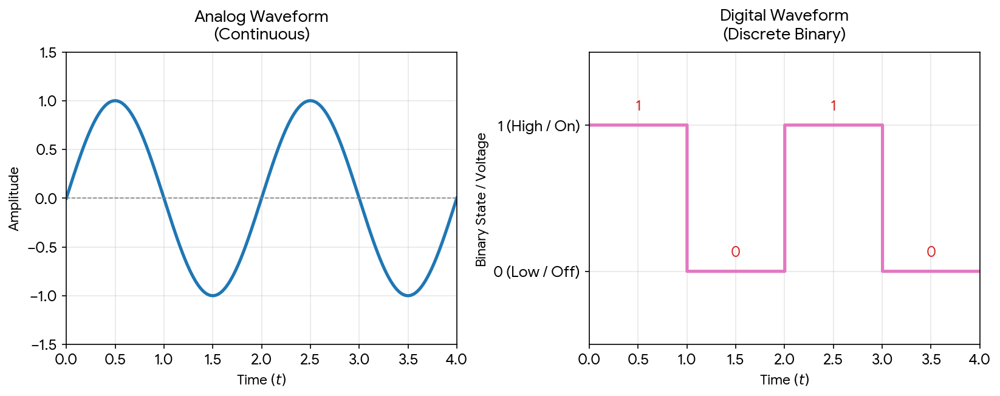

# Data Structures

> **Related problems:** [Day 0](/problems/dayZero)

## Data

Data is raw, unprocessed information, such as text, numbers, images, audio, video, documents, tables, and figures.

## Data Structure

A data structure is a way of organizing data so that it can be stored, accessed, manipulated, and maintained efficiently.

### Bit and Byte
- **Bit**: The smallest unit of data in a computer, which can have a value of either 0 or 1.
- **Byte**: A group of 8 bits that can represent a character or a small number.

> 1 byte = 8 bits = $2^3$ bits

### Number Systems

- **Binary Number System**: Base 2, uses digits 0 and 1
- **Octal Number System**: Base 8, uses digits 0-7
- **Decimal Number System**: Base 10, uses digits 0-9
- **Hexadecimal Number System**: Base 16, uses digits 0-9 and letters A-F

Memory addresses in a system are commonly represented using the hexadecimal number system.

> 1 KB = 1024 bytes = $2^{10}$ bytes

## Data Structure System

The structure (or format) used to store and access data in a system is called a data structure.

An algorithm is a procedure used to process, manipulate, store, or access data.

## Forms of Representation of Data Structures
- Pseudocode
- Flowcharts
- Algorithm documentation
- Code

## Primitive Data Structures (Built-In)
### Simple or Basic Built-Ins
  - Integer
  - Float
  - String
  - Boolean
### Collection or Container Built-Ins
  - List
  - Tuple
  - Set
  - Dictionary

## Non-Primitive Data Structures (ADTs)

### Linear Data Structures

- Arrays
- Linked lists
- Stacks
- Queues

### Non-Linear Data Structures

- Trees
- Graphs

## Abstract Data Type (ADT)

An abstract data type defines how a data structure is organized and the operations it supports without specifying implementation details.
 
## Linear Data Structure

Elements are arranged in sequential order, one after another. They can be traversed in one direction at a time, either forward or backward.

> **Note:** Random access is also possible in some linear data structures.
 
## Non-Linear Data Structure

Elements are arranged in a non-sequential order with branches. They can be traversed breadth-first (horizontally) or depth-first (vertically).