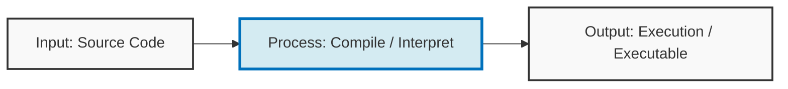
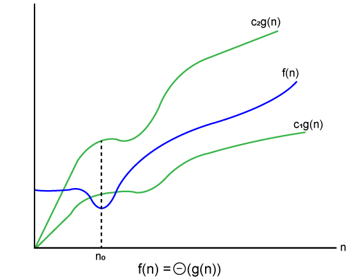
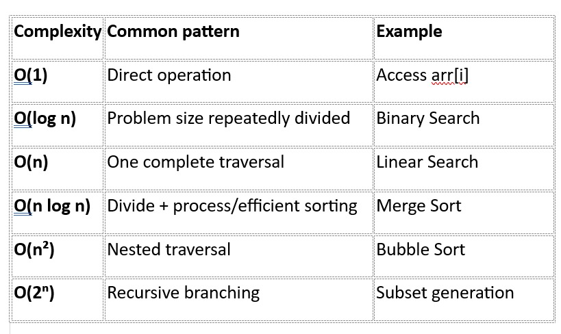
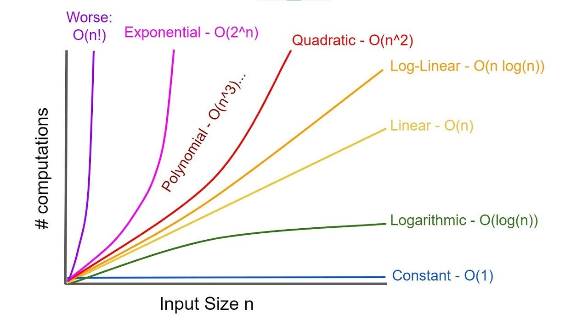

# Time and Space Complexity

Time complexity describes the amount of time an algorithm takes to complete as a function of the input size. It is commonly expressed using asymptotic notation, such as Big O notation.

## Characteristics

- Does not depend on the execution time of a particular machine.
- Is based on the algorithm and its implementation.
- May vary depending on the programming language and runtime environment.

## Asymptotic Notation

- **Big O ($O$):** Describes an upper bound, commonly used for worst-case analysis.
- **Big Omega ($\Omega$):** Describes a lower bound, commonly used for best-case analysis.
- **Big Theta ($\Theta$):** Describes a tight bound.

## Complexity Growth Hierarchy

From best to worst:

1. **Constant:** $O(1)$
2. **Logarithmic:** $O(\log n)$
3. **Linear:** $O(n)$
4. **Linearithmic:** $O(n \log n)$
5. **Quadratic:** $O(n^2)$
6. **Polynomial:** $O(n^3), \ldots$
7. **Exponential:** $O(2^n)$
8. **Factorial:** $O(n!)$

- **Upper bound:** $O(\lceil n/2 \rceil)$
- **Lower bound:** $O(\lfloor n/2 \rfloor)$

## Common Time Complexities

1. **$O(1)$ — Constant time:** The running time is independent of the input size.
2. **$O(\log n)$ — Logarithmic time:** The running time grows slowly as the input size increases; this is common in divide-and-conquer algorithms.
3. **$O(n)$ — Linear time:** The running time is directly proportional to the input size.
4. **$O(n \log n)$ — Linearithmic time:** Common in efficient sorting algorithms such as merge sort and quicksort.
5. **$O(n^2)$ — Quadratic time:** The running time is proportional to the square of the input size.
6. **$O(2^n)$ — Exponential time:** The running time grows rapidly as the input size increases; this is common in brute-force algorithms.
7. **$O(n!)$ — Factorial time:** The running time grows even more rapidly than exponential time; this is common in combinatorial problems.

## Space Complexity

**Time complexity** is the total amount of time an algorithm takes to complete its execution.

**Space complexity** is the total amount of memory an algorithm requires to complete its execution.

> **Space complexity = Auxiliary space + Input space**

